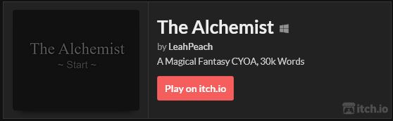

# Twine Template
> Warning: This template is still in the process of having documentation put together.

This repository exists to give aspiring authors an idea of how to put together a workflow containing:
* Twine 2
* SugarCube
* Tweego 2

The best way to show an example of a workflow is to simply create a project using it. This has the added benefit of showing novice users how to use the additional functionality that Twine provides. However, GitHub doesn't allow people to publically share NSFW works for this purpose, so I've made this template instead.

This template has been used to make the following games:

[](https://leahiel.itch.io/alchemist)

## Cloning this Repository
To clone this repository, you can run `git clone https://github.com/leahiel/Twine-Template` in a terminal such as command prompt or your IDE's terminal to populate that directory with these files. This isn't enough to run this repository, you also have to install Twine 2, SugarCube, and Tweego.

Once installed, you can run `tweego -o release.html src` to output this program as `release.html` and play it on your browser. Alternatively, you can run `tweego -o hottest.html src -w -t` to `hottest.html` in testmode. The program will then watch for source changes, and when it detects one, it will rebuild `hottest.html`, which means you just have to refresh the browser without running the command again. Convenient!

For detailed installation, story formating, and compilation instructions see [Detailed Installation Instructions](DOCUMENTATION/INSTALLATION.md).


## Preparing for Tweego's First Compilation
Installing a story format in Tweego is as simple as unziping the contents of your SugarCube zip file in your `/Tweego/storyformats/sugarcube-2` directory. If you don't have a `/storyformats/sugarcube-2` subdirectory, create it.

However, this isn't enough to start your program. You must create a `.tw` (for instance, [start.tw](src/start.tw)) file containing the following code:
```twee3-sc2
:: StoryData
{
	"ifid": "",
    "format": "SugarCube",
    "format-version": "2.36.1"
}

:: StoryTitle
Hello World

:: Start
Hello World~!
```
This may look a little strange, but don't fret. Each `:: Phrase` denotes to Tweego what Passage you're writing. Except we need to pass a few special Passages so that Tweego can compile our work for us.

The `:: StoryData` Passage gives Tweego important information about your project so it can compile all the myriad of documents you have together. Be sure to use the correct `format-version` that you downloaded. `ifid` should be automatically generated for you. The `:: StoryTitle` Passage, as expected, gives the title of the story. The `:: Start` Passage lets Tweego know where to actually start your story. This is where you'd put your story!

When you first compile this, (for instance, with `tweego -o release.html src`) you'll have an error generated for you that looks something like this:
```
Copy the following line into the "StoryData" special passage's JSON block (at the top):
        "ifid": "8A8A688E-FF61-42B9-96BA-02F3C9EA3DD7",
```
You may have to scroll up on your CLI to see it. 

IFID stands for "Interactive Fiction IDentifier", and it's a unique code used to identify your project. You'll need to put the generated IFID at the proper place in `:: StoryData`
